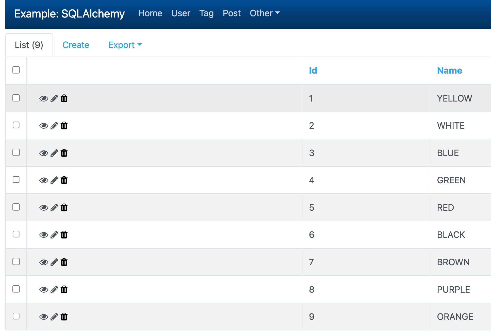

# gadmin
`gadmin` solves the boring problem of building an admin interface on top of an existing data model. With little effort, it lets you manage your web service’s data through a user-friendly interface.

## How does it work?
The basic concept behind `gadmin`, is that it lets you build complicated interfaces by grouping individual views together in classes: Each web page you see on the frontend, represents a method on a class that has explicitly been added to the interface.

We write `gadmin` in Go, depend on `net/http`, `template/html` and `gorm`.

## Example
- Mmodel view
```go
mv := gadmin.NewModelView(User{}).
    SetColumnList("type", "first_name", "last_name", "email", "ip_address", "currency", "timezone", "phone_number").
    SetColumnEditableList("first_name", "type", "currency", "timezone").
    SetColumnDescriptions(map[string]string{"first_name": "First Name"}).
    SetCanSetPageSize(true).
    SetPageSize(5).
    SetTablePrefixHtml(`<h4>Some Caution</h4>`)
admin.AddView(mv)
```

- View
```go
```


# Flask-Admin
Inspired by `Flask-Admin`. Copy the template files from flask-admin(bootstrap4 only).

# Status
- ✅ menu
- ✅ blueprint
- ✅ middleware: session, csrf, flashed
- ✅ misc
    - ✅ translate
    - [] config
- ✅ list
    - ✅ sort
    - [] filter
    - [] search
    - [] action
- [] model
    - [] preload
    - [] join
    - [] Multiple Primary Keys
- ✅ model detail
- [] modal
- ✅ [examples/simple](examples/simple/main.go)
- ✅ [examples/sqla](examples/sqla/admin/main.go)
- [] auth/login

